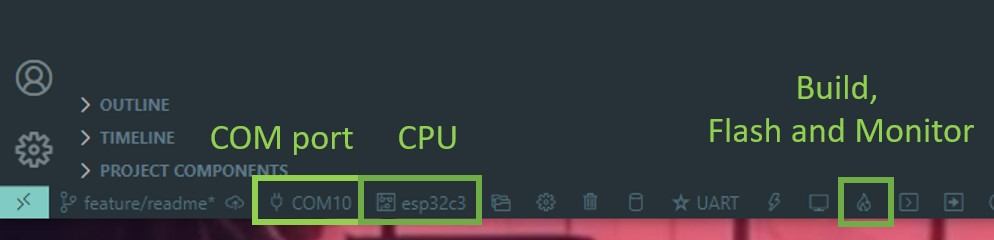
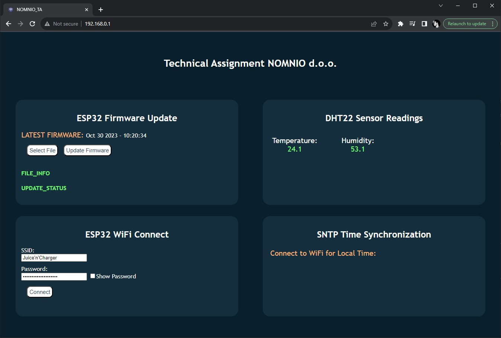
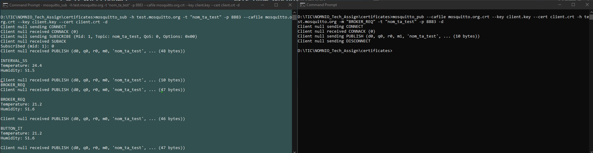

# Nomnio d.o.o. Technical Assignment

## Summary

Repository is an implementation of the technical assignment for job application at Nomnio d.o.o. 

Assigment had multiple components, but general idea was to connect ESP32-C3_DevKitM-1 board to Wi-Fi and publish data provided from arbitrary sensor (DHT22 in this case) to an MQTT broker every 5 seconds. Additionaly, functionality to publish data after the button interrupt occurs and by brokers' request was implemented. All three methods of publishing work simultaneously in real time. Alongside functionality on embedded level, a HTTP server was established to handle on-board webpage with multiple functionalities:
- OTA (over-the-air) update. After every build, a .bin file is created and could be used for remote updates.
- Read-out of DHT22 temperature sensor measurements - temperature and humidity
- Wi-Fi connection to any other AP, with user inputs for AP credentials (SSID and password)
- SNTP dashboard with 10-second interval of time refresh.


## Setup

### Hardware
Equipment:
- ESP32-C3_DevKitM-1
- DHT22 temperature and humidity sensor
- micro-USB to USB-A cable
- 3 header wires to connect sensor to a ESP32-C3

Preparation is simple, connect sensor to an ESP32-C3 as shown in table below:

|DHT22          |ESP32-C3_DevKitM-1 |
|-              |-                  |
|POWER          |+3.3V power rail   |
|DATA           |GPIO_PIN_2         |
|GND            |GND                |

After this connect C3_DevKitM-1 to computer. Check for COM port designation in the systems' *Device Manager*.

### Software enviroment
Equipment:
For code editing, a MS Visual Studio Code was used. Additionally, an official Espressif ESP-IDF Toolkit was installed as a VSCode extension. Also, installing C/C++ extension is mandatory, in order to connect include paths to a working direcotry. After the instalation choose the right COM port and CPU model. Both of those setting could be found on the bottom of VSCode window, as shown on picture below. Code can then be built and flashed to DevKit.



#### *NOTE*: In some occasions C/C++ extesion does not set all the include paths automatically, so it should be added manually. Other method is to add the folliwing line into the *c_cpp_properties.json*
```
"configurations":
{
    ...

    "compileCommands": "${workspaceFolder}/build/compile_commands.json",

    ...
}
```

## Accessing webpage
In order to access webpage, user needs to be connected to a HTTP server, which is possible through WiFi access point that this build provides. After the code starts, a Wifi AP is autommatically available to be connected onto. Credentials for WiFi AP are
- **SSID:** "ESP32_AP_NOM_TA"
- **Password:** "password123"

Connection to this access point creates internal DHCP which dinamically assigns IP address *192.168.0.1*. After connection is esablished, go to this address to access the page. 



## Updating FIrmware
While the webpage is on, buttons in the **ESP32 Firmware Update** section will do the trick in following fashion:
- **Select File** : Opens a file explorer window to browse for a .bin file. The one is located in:
    ```
    /${WORKSPACE}/build/%BUILD_NAME%.bin
    ```
- **Update Firmware**: Starts the update procedure.

After the update is finished, a message upon success will display, alongside with 10 second reset timer.
#### *NOTE*: New build that is flashed with OTA must have same WiFi AP settings in order to avoid either critical error or user intervention (disconnecting from previous SSID manually while the 10 second timer counts).


## Connecting to an external AP
While the webpage is on, in section **ESP32 Wifi Connect** are input fields that user can fill in to connect to some other AP (e.g. home network). In that case ESP32 starts to work as both station and access point. This step is prerequisite for MQTT communication with the broker. Once connected, an SNTP server will respond to our request and provide us with current time.

## MQTT Broker SUB/PUB
After the connection to an external AP is achieved, three different modes of communication with an external broker are possible:
- **INTERVAL**: Data (payload) from DHT22 will be sent to a broker within 5 second intervals, immiediately after the boot. This process is automatic and cannot be stopped.

- **BUTTON** : Upon pressing the *BOOT* button on the ESP32-C3_DevKitM-1 a new message will be sent, since the code defines that interrupt on button GPIO triggers new payload publish

- **BROKER REQUEST**: Each time user publishes cerain payload to ESP32, a return mesasge will be sent back to the broker (payload containing temperature and humidity measurements).

### Broker view and interraction windows.
For this project, [test.mosquitto.org](https://test.mosquitto.org) broker was used, with minimal GUI tools (only Command Prompt (CMD)). Important step before trying anything is to insatll mosquitto libraries and add them to your systems' PATH.

After the instalation of libraries:
1. Open two separate CMD windows. One will serve as broker view (to see broker reposnse), while the other will use as broker console (to publish payload from the broker).
2. Disconnect your computer from the ESP32 AP. Connection with outside world is mandatory if we want to interract with the broker as admin.

In the picture below, grey window represents the View monitor, while the black is Console window. 

To enable real-time view, enter in View monitor:
```
mosquitto_sub -h test.mosquitto.org -t "nom_ta_test" -p 8883 --cafile mosquitto.org.crt --key client.key --cert client.crt -d
```

To send request from the broker to an ESP32, enter in Console window:
```
mosquitto_pub --cafile mosquitto.org.crt --key client.key --cert client.crt -h test.mosquitto.org -m "BROKER_REQ" -t "nom_ta_test" -p 8883 -d
```
The picture below shows both CMS windows in mutual interaction with all three payload publishing approaches achieved within the same runtime.




# Contact
For any questions and/or bug reports contact me over the [email](zz.tib047@gmail.com).

# Special thanks
To both D.H and M.H for giving me the opportunity to explore other and, in my humble opinion, more interesting fields. Fulfilled with explorational spirit - that's a brief summary of myself over the course of past few weeks. Thank you so much for your patience, and I'm sincerely looking forward to our future colaboration and ventures ahead.

-TS